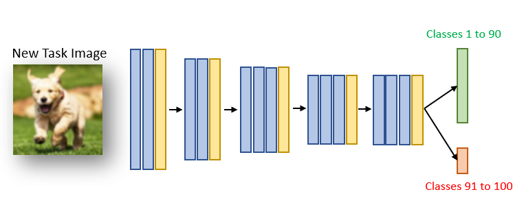

# Learning without Forgetting ([Link](https://arxiv.org/abs/1606.09282)).

This is a very basic implementation of the foundational paper in lifelong learning domain. I implemented this for a project I have been working on recently.

## Experimental Setup

Dataset Used: CIFAR100

Model: VGG16

Old Task: Class 1 to 90

New Task: Class 90 to 100

<div align=center></div>

##### Training with LwF 

Log file: logs/123230.out

| Images Used       | Old Task Acc. | New Task Acc.|
|-------------------|---------------|----------|
| Old Task | 70.15%        | 0%       |
| New Task | 69.83%        | 90.40%   |

```shell
python run_cifar.py --t1-weight 0.1
```

##### Training without LwF 


| Images Used      | Old Task Acc.| New Task Acc.|
|------------------|----------|----------|
| Old Task | 70.15%   | 0%       |
| New Task | 63.10%   | 91.40%   |

```shell
python run_cifar.py --t1-weight 0
```
